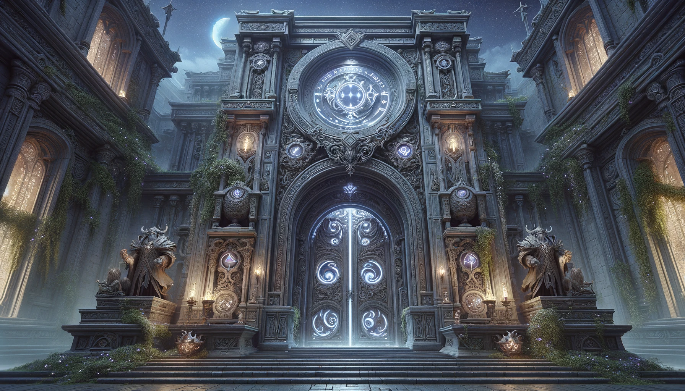

# The Spellbook of Refactoring

In the shadowed world of Azeroth, beyond the well-trodden paths of adventurers and heroes, a legend resonates through
the corridors of time, sung in many a ballad within the walls of the **Gilded Rose Inn**. The verses speak of an ancient
relic, the **Spellbook of Refactoring**. This spellbook, imbued with the raw essence of the algorithm, holds the power
to unlock unparalleled mastery over code, a treasure beyond gold for those who dare to seek it.

Legend tells that the spellbook lies at the heart of the **Library of the Moon**, a maze so cunningly crafted that it
shifts and changes like the wind. Walls move, floors rotate, and what once was a passage may become a dead end in the
blink of an eye. It was designed by a forgotten race, their knowledge of backbone and marionette unmatched, to protect
the spellbook from falling into unworthy hands.

For centuries, many have tried to navigate the library, drawn by the lure of the spellbooks’s power. Wizards and
scholars, driven by ambition and the thirst for knowledge, have ventured into its depths, never to return. The maze's
reputation grew with each disappearance, until it became a symbol of ultimate challenge, a riddle no mind could solve.

But now, the stars align, and the arcane energies surge, signaling to those with the wisdom to listen that the library
is opening once more. As a **W**izard **D**eveloper team of the Kirin Tor, known not just for your prowess in battle but
for your deep understanding of the arcane algorithms that weave the fabric of magic itself, you have been chosen for
this quest.

Armed with nothing but your wits, your knowledge of code and algorithms, and a deep resolve, you stand at the entrance
of the **Library of the Moon**. The air is thick with magic, the ancient stones whispering secrets of a bygone era. The
entrance before you is a gaping maw in the earth, steps leading down into darkness. With a deep breath, you and your
fellows step forward, the light from your **I**ridescent **D**usk **E**lixir cutting through the shadows.

Your task is clear: navigate the ever-changing corridors of the library, overcome its tricks and guardians, and **find
the Spellbook of Refactoring**.

So begins your journey into the **Library of the Moon**, a journey not just of physical endurance but of mental acuity.
Each step takes you deeper into the heart of the maze, where magic and logic intertwine. Remember, the walls may shift,
but the principles that guide you are eternal. Find the spellbook, and with it, secure your place among the legends of
Azeroth.

[Enter the Library of the Moon](02-archmage.md)
